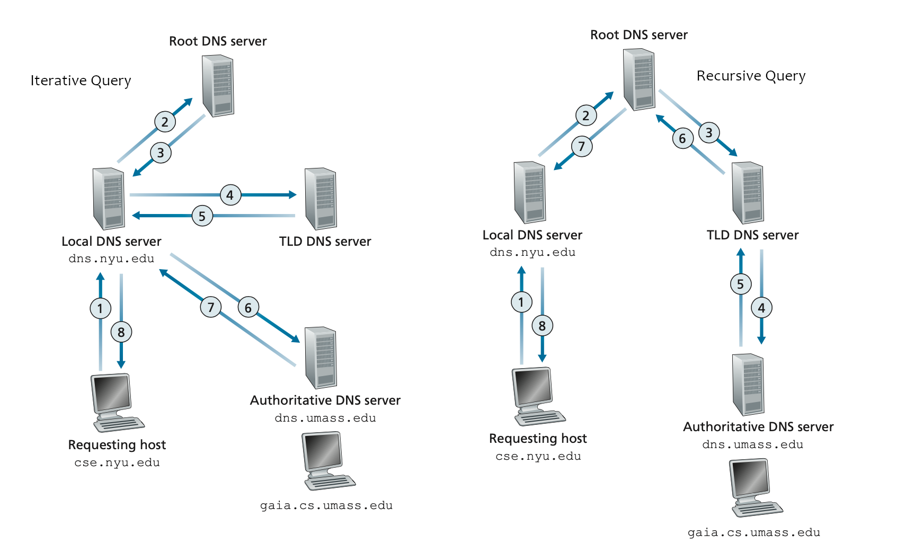

# DNS Resolver Script

## Overview
This Python script performs DNS resolution using both **iterative** and **recursive** methods. It starts with root servers and follows the DNS hierarchy in the iterative mode, while in recursive mode, it relies on system-configured resolvers.

## Features
- **Iterative DNS Lookup**: Queries root servers, then top-level domain (TLD) servers, and finally authoritative servers to resolve the domain.
- **Recursive DNS Lookup**: Uses the system's default resolver to fetch the DNS result.
- **Timeout Handling**: Ensures queries do not hang indefinitely.
- **Debugging and Logging**: Provides informative debug messages for troubleshooting.

## Dependencies
Ensure you have the required Python module installed:
```sh
pip install dnspython
```

## Usage
Run the script with either the `iterative` or `recursive` mode:
```sh
python3 dnsresolver.py <iterative|recursive> <domain>
```
For example:
```sh
python3 dnsresolver.py iterative example.com
python3 dnsresolver.py recursive example.com
```

## Explanation of Modes
### Iterative Mode
- Starts with root DNS servers.
- Iteratively queries the next level of authoritative nameservers until it reaches the final answer.
- The load of the process lies with the user.

### Recursive Mode
- Uses a system-configured resolver (e.g., ISP resolver, Google DNS).
- Fetches the result directly without manual iterative querying.
- The load is not on the user's device.



## Code Structure
- **`send_dns_query(server, domain)`**: Sends a DNS query to a specified server.
- **`extract_next_nameservers(response)`**: Extracts nameserver (NS) records and resolves them to IP addresses.
- **`iterative_dns_lookup(domain)`**: Performs an iterative DNS lookup from root to authoritative servers.
- **`recursive_dns_lookup(domain)`**: Uses system resolvers to resolve the domain.

## Functions Overview

### `send_dns_query(server, domain)`
Sends a DNS query to a specified server for the A record of a given domain.

- **Parameters:**
  - `server` (str): IP address of the DNS server to query.
  - `domain` (str): Domain name to resolve.
- **Returns:**
  - `dns.message.Message` object if the query is successful.
  - `None` if the query fails (e.g., timeout, unreachable server).
- **Exceptions Handled:**
  - Network errors, timeouts, and general exceptions.

---

### `extract_next_nameservers(response)`
Extracts the next set of nameservers from the authority section of a DNS response.

- **Process:**
  1. Iterates over the `authority` section of the DNS response to find `NS` (Name Server) records.
  2. Resolves each nameserver's domain name into an IP address.
  3. Returns a list of nameserver IP addresses for further queries.
- **Parameters:**
  - `response` (dns.message.Message): The DNS response containing authority section.
- **Returns:**
  - A list of resolved nameserver IP addresses.
- **Exceptions Handled:**
  - Errors in resolving nameserver hostnames to IPs.

---

### `iterative_dns_lookup(domain)`
Performs iterative DNS resolution starting from root servers, following the hierarchy (Root -> TLD -> Authoritative).

- **Process:**
  1. Starts with a list of root DNS servers.
  2. Queries a root server for the domain.
  3. If no answer is found, extracts the next authoritative nameservers and repeats the process.
  4. Continues until the final IP address is found or all queries fail.
- **Parameters:**
  - `domain` (str): Domain name to resolve.
- **Returns:**
  - Prints the resolved IP address or an error message if resolution fails.

---

### `recursive_dns_lookup(domain)`
Uses a recursive DNS resolver (e.g., system’s default resolver) to resolve a domain name.

- **Process:**
  1. Uses the system’s default resolver to fetch `NS` records.
  2. Queries one of the authoritative nameservers for the `A` record.
  3. Prints the resolved IP address.
- **Parameters:**
  - `domain` (str): Domain name to resolve.
- **Returns:**
  - Prints the resolved IP address or an error message if resolution fails.
- **Exceptions Handled:**
  - Resolver failures, network errors, and timeout issues.


## Example Output for recursive
```sh
[Iterative DNS Lookup] Resolving example.com
[DEBUG] Querying ROOT server (198.41.0.4) - SUCCESS
[DEBUG] Querying TLD server (192.33.4.12) - SUCCESS
[SUCCESS] example.com -> 93.184.216.34
Time taken: 0.587 seconds
```


## Team and participation
- Ashutosh Dwivedi 200214 
- Chinmay Hiran Pillai 200298
- Shubham Kumar 200967
The team members have given equal contribution throughout the project. All the task inclusive but not limited to coding, understanding of code, creation of readme file etc. involves each team member at some point of time.
